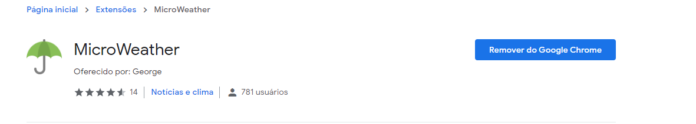

# Visualização Climática :file_folder:
:bookmark_tabs: **Reproduzindo a cópia de uma Extensão climática do Google Chrome**

### :information_source: Especificações do Projeto:

**Neste projeto foi feito uma cópia de Extensão Climática do Google Chrome, fazendo algumas alterações no resultado final. A Extensão original foi feita por George --> [Clique aqui para ver a Extensão original](https://chrome.google.com/webstore/detail/microweather/mlkbifdobkhikfmhopopgdfikiilbhio/related) <-- e possui opções como pesquisa de Cidade entre outras mais. Nessa adaptação feita aqui, a Extensão retorna apenas o clima da cidade de São Paulo, com 99% do conteúdo traduzido para o Português (Brasil)**

## 📌 Ferramentas usadas neste projeto: 

</img> **Visual Studio Code**

</img> **HTML5**

</img> **Java Script**

</img> **CSS3**

</img> **JSON**

### :information_source: Reforçando, acesse e baixe a Extensão do George para Google Chrome. Isso o ajuda bastante! (https://chrome.google.com/webstore/detail/microweather/mlkbifdobkhikfmhopopgdfikiilbhio/related)

  
  

  
  

